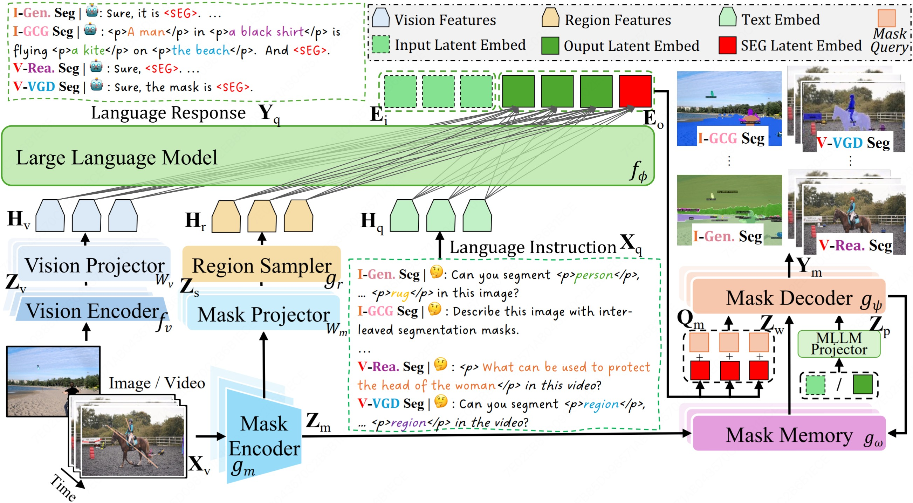

<div align="center">
<h1>✨X2SAM✨</h1>
<h3>Any Segmentation in Images and Videos</h3>

[Hao Wang](https://wanghao9610.github.io)<sup>1,2</sup>, [Limeng Qiao](https://scholar.google.com/citations?user=3PFZAg0AAAAJ&hl=en)<sup>3</sup>, [Chi Zhang]()<sup>3</sup>, [Guanglu Wan](https://scholar.google.com/citations?user=NRG_hpYAAAAJ&hl=en)<sup>3</sup>, [Lin Ma](https://forestlinma.com/)<sup>3</sup>, [Xiangyuan Lan](https://scholar.google.com/citations?user=c3iwWRcAAAAJ&hl)<sup>2</sup><sup>:email:</sup>, [Xiaodan Liang](https://scholar.google.com/citations?user=voxznZAAAAAJ&hl)<sup>1</sup><sup>:email:</sup>

<sup>1</sup> Sun Yat-sen University, <sup>2</sup> Peng Cheng Laboratory, <sup>3</sup> Meituan Inc.

<sup>:email:</sup> Corresponding author
</div>

<div align="center" style="display: flex; justify-content: center; align-items: center;">
  <a href="" style="margin: 0 2px;">
    
  </a>
  <a href='https://huggingface.co/hao9610/X2SAM' style="margin: 0 2px;">
    
  </a>
  <a href="https://github.com/wanghao9610/X2SAM" style="margin: 0 2px;">
    
  </a>
  <a href="" style="margin: 0 2px;">
    
  </a>
  <a href='https://wanghao9610.github.io/X2SAM/' style="margin: 0 2px;">
    
  </a>
</div>

## :eyes: Notice

> **Note:** X2SAM is under active development, and we will continue to update the code and documentation. Please check [TODO](#white_check_mark-todo) to get our development schedule.

We strongly recommend that everyone uses **English** to communicate in issues. This helps developers from around the world discuss, share experiences, and answer questions together. 

*If you have any questions or would like to collaborate, please feel free to open an issue or reach out to me at `wanghao9610@gmail.com`.*

## :boom: Updates
- **`2026-03-20`**: We create the X2SAM github repo.

## :rocket: Highlights

This repository provides the official PyTorch implementation, pre-trained models, training, evaluation, visualization, and demo code of X2SAM:
* TODO

* TODO

* TODO


## :bookmark: Abstract

> This is the abstract of X2SAM.

## :mag: Framework

<div align="center">
  <!--  -->
  <p><em>Figure 1: The overview of X2SAM.</em></p>
</div>

## :bar_chart: Benchmarks

## :checkered_flag: Getting Started

### 1. Structure
We provide a detailed project structure for X-SAM. Please follow this structure to organize the project.

<details open>
<summary><b>📁 Project Structure (Click to collapse)</b></summary>

```bash

```
</details>

### 2. Enviroment
```

```

### 3. Dataset
Please refer to [datasets.md](docs/mds/datasets.md) for detailed instructions on data preparation.


### 4. Model
Download our pre-trained models from [HuggingFace](https://huggingface.co/hao9610/X2SAM) and place them in the `inits` directory.


### 5. Training

*⏳ Coming soon...*

### 6. Evaluation

#### Image and Video Segmentation Benchmarks Evaluation

*⏳ Coming soon...*

#### Image and Video Chat Benchmarks Evaluation

*⏳ Coming soon...*


## :computer: Demo

### Local Demo
<details open>
<summary><b>🏞️ / 🎥 Inference(Click to collapse)</b></summary>

```bash

```
</details>

### Web Demo 

<details open>
<summary>🛠️ Deployment (Click to collapse)</summary>

```bash

```
</details>

## :white_check_mark: TODO

- [ ] Release the paper on arXiv.
- [ ] Release the demo website.
- [ ] Release the pre-trained models.
- [ ] Release the evaluation code.

## :blush: Acknowledge
This project has referenced some excellent open-sourced repos ([xtuner](https://github.com/InternLM/xtuner), [VLMEvalKit](https://github.com/open-compass/VLMEvalKit), [X-SAM](https://github.com/wanghao9610/X-SAM)). Thanks for their wonderful works and contributions to the community!


## :pushpin: Citation
If you find X2SAM and X-SAM are helpful for your research or applications, please consider giving us a star 🌟 and citing the following papers by the following BibTex entry.

```bibtex
@article{wang2026x2sam,
  title={X2SAM: Any Segmentation in Images and Videos},
  author={Wang, Hao and Qiao, Limeng and Zhang, Chi and Wan, Guanglu and Ma, Lin and Lan, Xiangyuan and Liang, Xiaodan},
  journal={arXiv preprint arXiv:2603.00000},
  year={2026}
}

@article{wang2025xsam,
  title={X-SAM: From Segment Anything to Any Segmentation},
  author={Wang, Hao and Qiao, Limeng and Jie, Zequn and Huang, Zhijian and Feng, Chengjian and Zheng, Qingfang and Ma, Lin and Lan, Xiangyuan and Liang, Xiaodan},
  journal={arXiv preprint arXiv:2508.04655},
  year={2025}
}
```