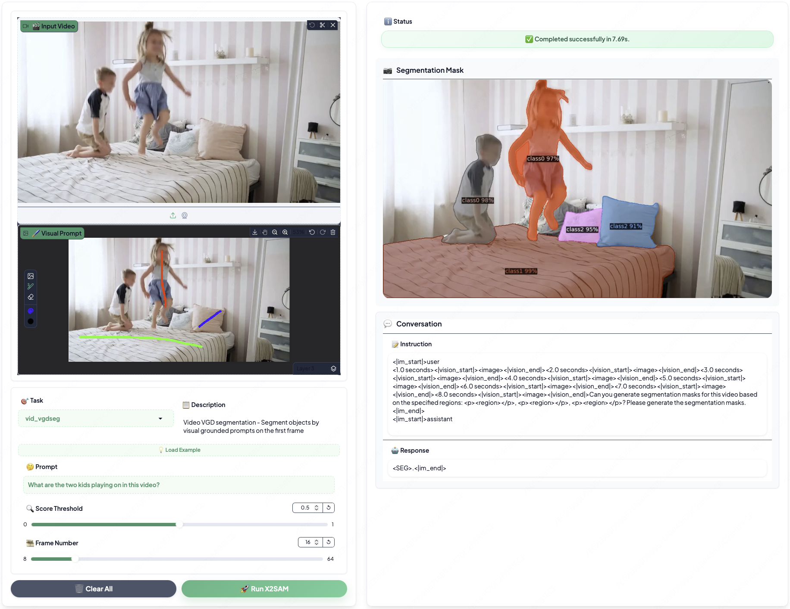

<div align="center">
<h1>✨X2SAM✨</h1>
<h3>Any Segmentation in Images and Videos</h3>

[Hao Wang](https://wanghao9610.github.io)<sup>1,2</sup>, [Limeng Qiao](https://scholar.google.com/citations?user=3PFZAg0AAAAJ&hl)<sup>3</sup>, [Chi Zhang](https://scholar.google.com/citations?user=I0aKo_4AAAAJ&hl)<sup>3</sup>, [Guanglu Wan](https://scholar.google.com/citations?user=NRG_hpYAAAAJ&hl)<sup>3</sup>, [Lin Ma](https://forestlinma.com/)<sup>3</sup>, [Xiangyuan Lan](https://scholar.google.com/citations?user=c3iwWRcAAAAJ&hl)<sup>2</sup><sup>:email:</sup>, [Xiaodan Liang](https://scholar.google.com/citations?user=voxznZAAAAAJ&hl)<sup>1</sup><sup>:email:</sup>

<sup>1</sup> Sun Yat-sen University, <sup>2</sup> Peng Cheng Laboratory, <sup>3</sup> Meituan Inc.

<sup>:email:</sup> Corresponding author
</div>

<div align="center" style="display: flex; justify-content: center; align-items: center;">
  <a href="" style="margin: 0 2px;">
    
  </a>
  <a href='https://huggingface.co/hao9610/X2SAM' style="margin: 0 2px;">
    
  </a>
  <a href="https://github.com/wanghao9610/X2SAM" style="margin: 0 2px;">
    
  </a>
  <a href="" style="margin: 0 2px;">
    
  </a>
  <a href='https://wanghao9610.github.io/X2SAM/' style="margin: 0 2px;">
    
  </a>
</div>

## :eyes: Notice

> **Note:** X2SAM is under active development, and we will continue to update the code and documentation. Please check [TODO](#white_check_mark-todo) to get our development schedule.

We strongly recommend that everyone uses **English** to communicate in issues. This helps developers from around the world discuss, share experiences, and answer questions together. 

*If you have any questions, please feel free to open an issue or reach out to me at `wanghao9610@gmail.com`.*

## :boom: Updates

- **`2026-04-28`**: ✨ We have fully open-sourced X2SAM, including the training, evaluation, visualization, and demo code. Check out the [Quickstart](#checkered_flag-quickstart) to get hands-on.
- **`2026-03-20`**: 🫣 The X2SAM repository is now live. Paper and code updates are coming soon—stay tuned!

## :rocket: Highlights

This repository provides the official PyTorch implementation, pre-trained models, training, evaluation, visualization, and demo code of X2SAM:
* X2SAM introduces a unified segmentation MLLM framework that extends any-segmentation capabilities from images to videos, supporting generic, open-vocabulary, referring, reasoning, grounded conversation generation, interactive, and visual grounded segmentation in one model.

* X2SAM supports both conversational instructions and visual prompts through a unified interface, and couples an LLM with a Mask Memory module to store guided vision features for temporally consistent video mask generation.

* X2SAM proposes the Video Visual Grounded (V-VGD) segmentation benchmark and adopts a unified joint training strategy over heterogeneous image and video datasets, achieving strong video segmentation performance while remaining competitive on image segmentation and preserving general image/video chat ability.

✨ X2SAM offers a powerful and comprehensive solution for any segmentation task across both images and videos, featuring a unified pipeline for training and evaluation on all supported benchmarks. Whether you're new to segmentation MLLMs or looking to advance your research, X2SAM is an excellent starting point. We hope you enjoy exploring and using X2SAM!

## :book: Table of Contents
- [Abstract](#bookmark-abstract)
- [Overview](#mag-overview)
- [Benchmarks](#bar_chart-benchmarks)
- [Quickstart](#checkered_flag-quickstart)
- [Demo](#computer-demo)
- [TODO](#white_check_mark-todo)
- [Acknowledge](#blush-acknowledge)
- [Citation](#pushpin-citation)

## :bookmark: Abstract

> Multimodal Large Language Models (MLLMs) have demonstrated strong image-level visual understanding and reasoning, yet their pixel-level perception across both images and videos remains limited. Foundation segmentation models such as the SAM series produce high-quality masks, but they rely on low-level visual prompts and cannot natively interpret complex conversational instructions. Existing segmentation MLLMs narrow this gap, but are usually specialized for either images or videos and rarely support both textual and visual prompts in one interface. We introduce X2SAM, a unified segmentation MLLM that extends any-segmentation capabilities from images to videos. Given conversational instructions and visual prompts, X2SAM couples an LLM with a Mask Memory module that stores guided vision features for temporally consistent video mask generation. The same formulation supports generic, open-vocabulary, referring, reasoning, grounded conversation generation, interactive, and visual grounded segmentation across image and video inputs. We further introduce the Video Visual Grounded (V-VGD) segmentation benchmark, which evaluates whether a model can segment object tracks in videos from interactive visual prompts. With a unified joint training strategy over heterogeneous image and video datasets, X2SAM delivers strong video segmentation performance, remains competitive on image segmentation benchmarks, and preserves general image and video chat ability.

## :mag: Overview

<div align="left">
  
  <p><em>Figure 1: Overview of X2SAM. The Vision Encoder extracts global visual representations, while the Mask Encoder captures fine-grained visual features. The Large Language Model generates the language response and produces the latent condition embedding, which guides the Mask Decoder in generating the segmentation mask. The Mask Memory module stores guided vision features for each video frame, and the Region Sampler extracts region-of-interest embeddings from both images and videos.</em></p>
</div>

## :bar_chart: Benchmarks
<div align="left">
  
  <p><em>Table 1: Comparison of state-of-the-art segmentation methods across image and video segmentation benchmarks.</em></p>
</div>

👉 **More benchmark results can be found in [benchmarks.md](docs/mds/benchmarks.md).**

## :checkered_flag: Quickstart

### 1. Structure
We provide a detailed project structure for X2SAM. Please follow this structure to organize the project.

<details open>
<summary><b>📁 Project </b></summary>

```bash
X2SAM
├── datas
│   ├── img_chat
│   ├── img_gcgseg
│   ├── img_genseg
│   ├── img_intseg
│   ├── img_ovseg
│   ├── img_reaseg
│   ├── img_refseg
│   ├── img_sam
│   ├── img_vgdseg
│   ├── vid_chat
│   ├── vid_gcgseg
│   ├── vid_objseg
│   ├── vid_ovseg
│   ├── vid_reaseg
│   ├── vid_refseg
│   └── vid_vgdseg
├── inits
│   ├── huggingface
│   ├── Qwen3-VL-4B-Instruct
│   ├── X2SAM
│   ├── mask2former-swin-large-coco-panoptic
│   └── sam2.1-hiera-large
├── x2sam
│   ├── requirements
│   ├── x2sam
│   │   ├── configs
│   │   ├── dataset
│   │   ├── demo
│   │   ├── engine
│   │   ├── evaluation
│   │   ├── model
│   │   ├── registry
│   │   ├── structures
│   │   ├── tools
│   │   └── utils
├── wkdrs
│   ├── s1_train
│   │   ├── ...
│   ├── s2_train
│   │   ├── ...
│   ├── s3_train
│   │   ├── ...
│   ├── ...
...

```
</details>

### 2. Enviroment

#### Basic setup
```bash
# 1) Clone X2SAM and enter project home directory
git clone https://github.com/wanghao9610/X2SAM.git
cd X2SAM
export PROJ_HOME="$(realpath ./)"
export PYTHONPATH="$PROJ_HOME/x2sam:$PYTHONPATH"

# 2) Create and activate conda environment
conda create -n x2sam python=3.10 -y
conda activate x2sam

# 3) Install X2SAM dependencies
cd "$PROJ_HOME/x2sam"
pip install -r requirements.txt

# 4) Compile Deformable-Attention
cd "$PROJ_HOME/x2sam/x2sam/model/ops"
bash make.sh
```

#### Optional: set CUDA_HOME
```bash
export CUDA_HOME="your_cuda12.4_path"
export PATH="$CUDA_HOME/bin:$PATH"
export LD_LIBRARY_PATH="$CUDA_HOME/lib64:$LD_LIBRARY_PATH"
echo -e "CUDA version:\n$(nvcc -V)"
```

#### Optional: install VLMEvalKit
```bash
cd "$PROJ_HOME"
git clone -b v0.3rc1 https://github.com/open-compass/VLMEvalKit.git
cd VLMEvalKit
pip install -e .
```

### 3. Dataset
Please refer to [datasets.md](docs/mds/datasets.md) for detailed instructions on data preparation.


### 4. Model
Please refer to [models.md](docs/mds/models.md) for detailed instructions on model preparation.


### 5. Training

```bash
cd "$PROJ_HOME"
bash runs/gpu_run.sh \
  x2sam/x2sam/configs/x2sam/s3_train/x2sam_qwen3_vl_4b_sam2.1_hiera_large_m2f_e1_gpu32_s3_lora.py \
  "train segeval vlmeval visualize"
```

### 6. Evaluation

#### Image and Video Segmentation Benchmarks

```bash
cd "$PROJ_HOME"
bash runs/gpu_run.sh \
  x2sam/x2sam/configs/x2sam/s3_train/x2sam_qwen3_vl_4b_sam2.1_hiera_large_m2f_e1_gpu32_s3_lora.py \
  "segeval"
```

#### Image and Video Chat Benchmarks

```bash
cd "$PROJ_HOME"
bash runs/gpu_run.sh \
  x2sam/x2sam/configs/x2sam/s3_train/x2sam_qwen3_vl_4b_sam2.1_hiera_large_m2f_e1_gpu32_s3_lora.py \
  "vlmeval"
```

### 7. Visualization

```bash
cd "$PROJ_HOME"
bash runs/gpu_run.sh \
  x2sam/x2sam/configs/x2sam/s3_train/x2sam_qwen3_vl_4b_sam2.1_hiera_large_m2f_e1_gpu32_s3_lora.py \
  "visualize"
```

### 8. Tools
<details close>
<summary><b>Dataset Exploration</b></summary>
We provide a tool for dataset exploration, you can use it to explore the dataset and get the visualizations of the dataset.

```bash
cd "$PROJ_HOME"
python x2sam/tools/explore.py \
  x2sam/x2sam/configs/x2sam/s3_train/x2sam_qwen3_vl_4b_sam2.1_hiera_large_m2f_e1_gpu32_s3_lora.py \
  --output-dir "wkdrs/dataset_exploration" \
  --subset train \
  --max-samples 100
```

</details>

<details close>
<summary><b>Model Conversion</b></summary>
We provide a tool for model conversion, you can use it to convert the model to the Hugging Face checkpoint format.

```bash
cd "$PROJ_HOME"
python x2sam/tools/pth_to_hf.py \
  --work-dir "wkdrs/s3_train/x2sam_qwen3_vl_4b_sam2.1_hiera_large_m2f_e1_gpu32_s3_lora" \
  --tag-dir "last_checkpoint"
```

</details>

## :computer: Demo

### Local Demo
<details open>
<summary><b>🏞️ / 🎥 Inference</b></summary>

```bash
cd "$PROJ_HOME"
python x2sam/x2sam/demo/demo.py \
  x2sam/x2sam/configs/x2sam/s3_train/x2sam_qwen3_vl_4b_sam2.1_hiera_large_m2f_e1_gpu32_s3_lora.py \
  --pth_model "wkdrs/s3_train/x2sam_qwen3_vl_4b_sam2.1_hiera_large_m2f_e1_gpu32_s3_lora/pytorch_model.bin" \
  --task-name TASK_NAME \
  --image/--video INPUT_IMAGE/INPUT_VIDEO/INPUT_DIR \
  --prompt INPUT_PROMPT \
  --vprompt-masks INPUT_VPROMPT_MASKS \
```
</details>

<details Close>
<summary><b>🏞️ / 🎥 Examples</b></summary>

```bash

# Example: img_chat
python x2sam/x2sam/demo/demo.py \
  x2sam/x2sam/configs/x2sam/s3_train/x2sam_qwen3_vl_4b_sam2.1_hiera_large_m2f_e1_gpu32_s3_lora.py \
  --pth_model "wkdrs/s3_train/x2sam_qwen3_vl_4b_sam2.1_hiera_large_m2f_e1_gpu32_s3_lora/pytorch_model.bin" \
  --task-name img_chat \
  --image x2sam/x2sam/demo/sample.jpg \
  --prompt "What is unusal about this image?"

# Example: img_genseg
python x2sam/x2sam/demo/demo.py \
  x2sam/x2sam/configs/x2sam/s3_train/x2sam_qwen3_vl_4b_sam2.1_hiera_large_m2f_e1_gpu32_s3_lora.py \
  --pth_model "wkdrs/s3_train/x2sam_qwen3_vl_4b_sam2.1_hiera_large_m2f_e1_gpu32_s3_lora/pytorch_model.bin" \
  --task-name img_genseg \
  --image x2sam/x2sam/demo/sample.jpg \
  --output-dir "wkdrs/demo_outputs" \
  --prompt "Can you generate segmentation masks for this image based on the specified categories: <p>person</p>, <p>bicycle</p>, <p>car</p>, <p>motorcycle</p>, <p>airplane</p>, <p>bus</p>, <p>train</p>, <p>truck</p>, <p>boat</p>, <p>traffic light</p>, <p>fire hydrant</p>, <p>stop sign</p>, <p>parking meter</p>, <p>bench</p>, <p>bird</p>, <p>cat</p>, <p>dog</p>, <p>horse</p>, <p>sheep</p>, <p>cow</p>, <p>elephant</p>, <p>bear</p>, <p>zebra</p>, <p>giraffe</p>, <p>backpack</p>, <p>umbrella</p>, <p>handbag</p>, <p>tie</p>, <p>suitcase</p>, <p>frisbee</p>, <p>skis</p>, <p>snowboard</p>, <p>sports ball</p>, <p>kite</p>, <p>baseball bat</p>, <p>baseball glove</p>, <p>skateboard</p>, <p>surfboard</p>, <p>tennis racket</p>, <p>bottle</p>, <p>wine glass</p>, <p>cup</p>, <p>fork</p>, <p>knife</p>, <p>spoon</p>, <p>bowl</p>, <p>banana</p>, <p>apple</p>, <p>sandwich</p>, <p>orange</p>, <p>broccoli</p>, <p>carrot</p>, <p>hot dog</p>, <p>pizza</p>, <p>donut</p>, <p>cake</p>, <p>chair</p>, <p>couch</p>, <p>potted plant</p>, <p>bed</p>, <p>dining table</p>, <p>toilet</p>, <p>tv</p>, <p>laptop</p>, <p>mouse</p>, <p>remote</p>, <p>keyboard</p>, <p>cell phone</p>, <p>microwave</p>, <p>oven</p>, <p>toaster</p>, <p>sink</p>, <p>refrigerator</p>, <p>book</p>, <p>clock</p>, <p>vase</p>, <p>scissors</p>, <p>teddy bear</p>, <p>hair drier</p>, <p>toothbrush</p>, <p>banner</p>, <p>blanket</p>, <p>bridge</p>, <p>cardboard</p>, <p>counter</p>, <p>curtain</p>, <p>door</p>, <p>floor wood</p>, <p>flower</p>, <p>fruit</p>, <p>gravel</p>, <p>house</p>, <p>light</p>, <p>mirror</p>, <p>net</p>, <p>pillow</p>, <p>platform</p>, <p>playingfield</p>, <p>railroad</p>, <p>river</p>, <p>road</p>, <p>roof</p>, <p>sand</p>, <p>sea</p>, <p>shelf</p>, <p>snow</p>, <p>stairs</p>, <p>tent</p>, <p>towel</p>, <p>wall brick</p>, <p>wall stone</p>, <p>wall tile</p>, <p>wall wood</p>, <p>water</p>, <p>window blind</p>, <p>window</p>, <p>tree</p>, <p>fence</p>, <p>ceiling</p>, <p>sky</p>, <p>cabinet</p>, <p>table</p>, <p>floor</p>, <p>pavement</p>, <p>mountain</p>, <p>grass</p>, <p>dirt</p>, <p>paper</p>, <p>food</p>, <p>building</p>, <p>rock</p>, <p>wall</p>, <p>rug</p>? Please output the segmentation mask."

# Example: img_refseg
python x2sam/x2sam/demo/demo.py \
  x2sam/x2sam/configs/x2sam/s3_train/x2sam_qwen3_vl_4b_sam2.1_hiera_large_m2f_e1_gpu32_s3_lora.py \
  --pth_model "wkdrs/s3_train/x2sam_qwen3_vl_4b_sam2.1_hiera_large_m2f_e1_gpu32_s3_lora/pytorch_model.bin" \
  --task-name img_refseg \
  --image x2sam/x2sam/demo/sample.jpg \
  --output-dir "wkdrs/demo_outputs" \
  --prompt "Can you segment <p>the ironing man on the car</p> in this image? Please output the corresponding segmentation mask."

# Example: img_reaseg
python x2sam/x2sam/demo/demo.py \
  x2sam/x2sam/configs/x2sam/s3_train/x2sam_qwen3_vl_4b_sam2.1_hiera_large_m2f_e1_gpu32_s3_lora.py \
  --pth_model "wkdrs/s3_train/x2sam_qwen3_vl_4b_sam2.1_hiera_large_m2f_e1_gpu32_s3_lora/pytorch_model.bin" \
  --task-name img_reaseg \
  --image x2sam/x2sam/demo/sample.jpg \
  --output-dir "wkdrs/demo_outputs" \
  --prompt "<p>What can be used to warm clothes?</p> Please output the corresponding segmentation mask."

# Example: img_gcgseg
python x2sam/x2sam/demo/demo.py \
  x2sam/x2sam/configs/x2sam/s3_train/x2sam_qwen3_vl_4b_sam2.1_hiera_large_m2f_e1_gpu32_s3_lora.py \
  --pth_model "wkdrs/s3_train/x2sam_qwen3_vl_4b_sam2.1_hiera_large_m2f_e1_gpu32_s3_lora/pytorch_model.bin" \
  --task-name img_gcgseg \
  --image x2sam/x2sam/demo/sample.jpg \
  --output-dir "wkdrs/demo_outputs" \
  --prompt "Can you provide a brief description of the this image? Respond with interleaved segmentation masks for the corresponding phrases."

# Example: img_intseg
python x2sam/x2sam/demo/demo.py \
  x2sam/x2sam/configs/x2sam/s3_train/x2sam_qwen3_vl_4b_sam2.1_hiera_large_m2f_e1_gpu32_s3_lora.py \
  --pth_model "wkdrs/s3_train/x2sam_qwen3_vl_4b_sam2.1_hiera_large_m2f_e1_gpu32_s3_lora/pytorch_model.bin" \
  --task-name img_intseg \
  --image x2sam/x2sam/demo/sample.jpg \
  --output-dir "wkdrs/demo_outputs" \
  --prompt "Can you segment the <p><region></p> in this image? Please output the corresponding segmentation mask." \
  --vprompt-masks "x2sam/x2sam/configs/x2sam/samples/vpmasks/img_vpmask0.png"

# Example: img_vgdseg
python x2sam/x2sam/demo/demo.py \
  x2sam/x2sam/configs/x2sam/s3_train/x2sam_qwen3_vl_4b_sam2.1_hiera_large_m2f_e1_gpu32_s3_lora.py \
  --pth_model "wkdrs/s3_train/x2sam_qwen3_vl_4b_sam2.1_hiera_large_m2f_e1_gpu32_s3_lora/pytorch_model.bin" \
  --task-name img_vgdseg \
  --image x2sam/x2sam/demo/sample.jpg \
  --output-dir "wkdrs/demo_outputs" \
  --prompt "Can you segment the image based on the following regions: <p><region></p>, <p><region></p>? Please output the segmentation mask." \
  --vprompt-masks "x2sam/x2sam/configs/x2sam/samples/vpmasks/img_vpmask0.png" "x2sam/x2sam/configs/x2sam/samples/vpmasks/img_vpmask1.png"

# Example: vid_chat
python x2sam/x2sam/demo/demo.py \
  x2sam/x2sam/configs/x2sam/s3_train/x2sam_qwen3_vl_4b_sam2.1_hiera_large_m2f_e1_gpu32_s3_lora.py \
  --pth_model "wkdrs/s3_train/x2sam_qwen3_vl_4b_sam2.1_hiera_large_m2f_e1_gpu32_s3_lora/pytorch_model.bin" \
  --task-name vid_chat \
  --video x2sam/x2sam/demo/sample.mp4 \
  --prompt "Please describe this video in detail."

# Example: vid_genseg
python x2sam/x2sam/demo/demo.py \
  x2sam/x2sam/configs/x2sam/s3_train/x2sam_qwen3_vl_4b_sam2.1_hiera_large_m2f_e1_gpu32_s3_lora.py \
  --pth_model "wkdrs/s3_train/x2sam_qwen3_vl_4b_sam2.1_hiera_large_m2f_e1_gpu32_s3_lora/pytorch_model.bin" \
  --task-name vid_genseg \
  --video x2sam/x2sam/demo/sample.mp4 \
  --output-dir "wkdrs/demo_outputs" \
  --prompt "Could you provide segmentation masks for this video according to the specified categories: <p>wall</p>, <p>ceiling</p>, <p>door</p>, <p>stair</p>, <p>ladder</p>, <p>escalator</p>, <p>playground slide</p>, <p>handrail or fence</p>, <p>window</p>, <p>rail</p>, <p>goal</p>, <p>pillar</p>, <p>pole</p>, <p>floor</p>, <p>ground</p>, <p>grass</p>, <p>sand</p>, <p>athletic field</p>, <p>road</p>, <p>path</p>, <p>crosswalk</p>, <p>building</p>, <p>house</p>, <p>bridge</p>, <p>tower</p>, <p>windmill</p>, <p>well or well lid</p>, <p>other construction</p>, <p>sky</p>, <p>mountain</p>, <p>stone</p>, <p>wood</p>, <p>ice</p>, <p>snowfield</p>, <p>grandstand</p>, <p>sea</p>, <p>river</p>, <p>lake</p>, <p>waterfall</p>, <p>water</p>, <p>billboard or bulletin board</p>, <p>sculpture</p>, <p>pipeline</p>, <p>flag</p>, <p>parasol or umbrella</p>, <p>cushion or carpet</p>, <p>tent</p>, <p>roadblock</p>, <p>car</p>, <p>bus</p>, <p>truck</p>, <p>bicycle</p>, <p>motorcycle</p>, <p>wheeled machine</p>, <p>ship or boat</p>, <p>raft</p>, <p>airplane</p>, <p>tyre</p>, <p>traffic light</p>, <p>lamp</p>, <p>person</p>, <p>cat</p>, <p>dog</p>, <p>horse</p>, <p>cattle</p>, <p>other animal</p>, <p>tree</p>, <p>flower</p>, <p>other plant</p>, <p>toy</p>, <p>ball net</p>, <p>backboard</p>, <p>skateboard</p>, <p>bat</p>, <p>ball</p>, <p>cupboard or showcase or storage rack</p>, <p>box</p>, <p>traveling case or trolley case</p>, <p>basket</p>, <p>bag or package</p>, <p>trash can</p>, <p>cage</p>, <p>plate</p>, <p>tub or bowl or pot</p>, <p>bottle or cup</p>, <p>barrel</p>, <p>fishbowl</p>, <p>bed</p>, <p>pillow</p>, <p>table or desk</p>, <p>chair or seat</p>, <p>bench</p>, <p>sofa</p>, <p>shelf</p>, <p>bathtub</p>, <p>gun</p>, <p>commode</p>, <p>roaster</p>, <p>other machine</p>, <p>refrigerator</p>, <p>washing machine</p>, <p>microwave oven</p>, <p>fan</p>, <p>curtain</p>, <p>textiles</p>, <p>clothes</p>, <p>painting or poster</p>, <p>mirror</p>, <p>flower pot or vase</p>, <p>clock</p>, <p>book</p>, <p>tool</p>, <p>blackboard</p>, <p>tissue</p>, <p>screen or television</p>, <p>computer</p>, <p>printer</p>, <p>mobile phone</p>, <p>keyboard</p>, <p>other electronic product</p>, <p>fruit</p>, <p>food</p>, <p>instrument</p>, <p>train</p>? Please respond with the segmentation masks."

# Example: vid_refseg
python x2sam/x2sam/demo/demo.py \
  x2sam/x2sam/configs/x2sam/s3_train/x2sam_qwen3_vl_4b_sam2.1_hiera_large_m2f_e1_gpu32_s3_lora.py \
  --pth_model "wkdrs/s3_train/x2sam_qwen3_vl_4b_sam2.1_hiera_large_m2f_e1_gpu32_s3_lora/pytorch_model.bin" \
  --task-name vid_refseg \
  --video x2sam/x2sam/demo/sample.mp4 \
  --output-dir "wkdrs/demo_outputs" \
  --prompt "Can you segment <p>the jumping boy on the bed</p> in this video? Please output the corresponding segmentation mask."

# Example: vid_reaseg
python x2sam/x2sam/demo/demo.py \
  x2sam/x2sam/configs/x2sam/s3_train/x2sam_qwen3_vl_4b_sam2.1_hiera_large_m2f_e1_gpu32_s3_lora.py \
  --pth_model "wkdrs/s3_train/x2sam_qwen3_vl_4b_sam2.1_hiera_large_m2f_e1_gpu32_s3_lora/pytorch_model.bin" \
  --task-name vid_reaseg \
  --video x2sam/x2sam/demo/sample.mp4 \
  --output-dir "wkdrs/demo_outputs" \
  --prompt "<p>What are the two kids playing on in this video?</p> Please output the corresponding segmentation mask."

# Example: vid_gcgseg
python x2sam/x2sam/demo/demo.py \
  x2sam/x2sam/configs/x2sam/s3_train/x2sam_qwen3_vl_4b_sam2.1_hiera_large_m2f_e1_gpu32_s3_lora.py \
  --pth_model "wkdrs/s3_train/x2sam_qwen3_vl_4b_sam2.1_hiera_large_m2f_e1_gpu32_s3_lora/pytorch_model.bin" \
  --task-name vid_gcgseg \
  --video x2sam/x2sam/demo/sample.mp4 \
  --output-dir "wkdrs/demo_outputs" \
  --prompt "Can you provide a brief description of this video? Respond with interleaved segmentation masks for the corresponding phrases."

# Example: vid_objseg
python x2sam/x2sam/demo/demo.py \
  x2sam/x2sam/configs/x2sam/s3_train/x2sam_qwen3_vl_4b_sam2.1_hiera_large_m2f_e1_gpu32_s3_lora.py \
  --pth_model "wkdrs/s3_train/x2sam_qwen3_vl_4b_sam2.1_hiera_large_m2f_e1_gpu32_s3_lora/pytorch_model.bin" \
  --task-name vid_objseg \
  --video x2sam/x2sam/demo/sample.mp4 \
  --output-dir "wkdrs/demo_outputs" \
  --prompt "Can you segment the <p><region></p> in this video? Please output the corresponding segmentation mask." \
  --vprompt-masks "x2sam/x2sam/configs/x2sam/samples/vpmasks/vid_vpmask0.png"

# Example: vid_vgdseg
python x2sam/x2sam/demo/demo.py \
  x2sam/x2sam/configs/x2sam/s3_train/x2sam_qwen3_vl_4b_sam2.1_hiera_large_m2f_e1_gpu32_s3_lora.py \
  --pth_model "wkdrs/s3_train/x2sam_qwen3_vl_4b_sam2.1_hiera_large_m2f_e1_gpu32_s3_lora/pytorch_model.bin" \
  --task-name vid_vgdseg \
  --video x2sam/x2sam/demo/sample.mp4 \
  --output-dir "wkdrs/demo_outputs" \
  --prompt "Can you segment the video based on the following regions: <p><region></p>, <p><region></p>? Please output the segmentation mask." \
  --vprompt-masks "x2sam/x2sam/configs/x2sam/samples/vpmasks/vid_vpmask0.png" "x2sam/x2sam/configs/x2sam/samples/vpmasks/vid_vpmask1.png"
```

</details>

### Web Demo

<details open>
<summary>🛠️ Deployment</summary>

```bash
cd "$PROJ_HOME"
python x2sam/x2sam/demo/app.py \
  x2sam/x2sam/configs/x2sam/s3_train/x2sam_qwen3_vl_4b_sam2.1_hiera_large_m2f_e1_gpu32_s3_lora.py \
  --pth_model "wkdrs/s3_train/x2sam_qwen3_vl_4b_sam2.1_hiera_large_m2f_e1_gpu32_s3_lora/pytorch_model.bin" \
  --log-dir "wkdrs/app_logs" \
  --seed 0 \
  --port 7860
```

Then, you can access the demo website at `http://localhost:7860`.

<div align="center">
  
</div>
</details>

## :white_check_mark: TODO

- [x] Release the paper on arXiv.
- [x] Release the pre-trained models.
- [x] Release the demo website.
- [x] Release the demo instructions.
- [x] Release the evaluation code.
- [x] Release the training code.

## :blush: Acknowledge
This project has referenced some excellent open-sourced repos ([xtuner](https://github.com/InternLM/xtuner), [VLMEvalKit](https://github.com/open-compass/VLMEvalKit), [X-SAM](https://github.com/wanghao9610/X-SAM)). Thanks for their wonderful works and contributions to the community!


## :pushpin: Citation
If you find X2SAM and X-SAM are helpful for your research or applications, please consider giving us a star 🌟 and citing the following papers by the following BibTex entry.

```bibtex
@article{wang2026x2sam,
  title={X2SAM: Any Segmentation in Images and Videos},
  author={Wang, Hao and Qiao, Limeng and Zhang, Chi and Wan, Guanglu and Ma, Lin and Lan, Xiangyuan and Liang, Xiaodan},
  journal={arXiv preprint arXiv:2603.00000},
  year={2026}
}

@inproceedings{wang2026xsam,
    title={X-SAM: From segment anything to any segmentation},
    author={Wang, Hao and Qiao, Limeng and Jie, Zequn and Huang, Zhijian and Feng, Chengjian and Zheng, Qingfang and Ma, Lin and Lan, Xiangyuan and Liang, Xiaodan},
    booktitle={Proceedings of the AAAI Conference on Artificial Intelligence},
    volume={40},
    number={31},
    pages={26187--26196},
    year={2026}
  }
```