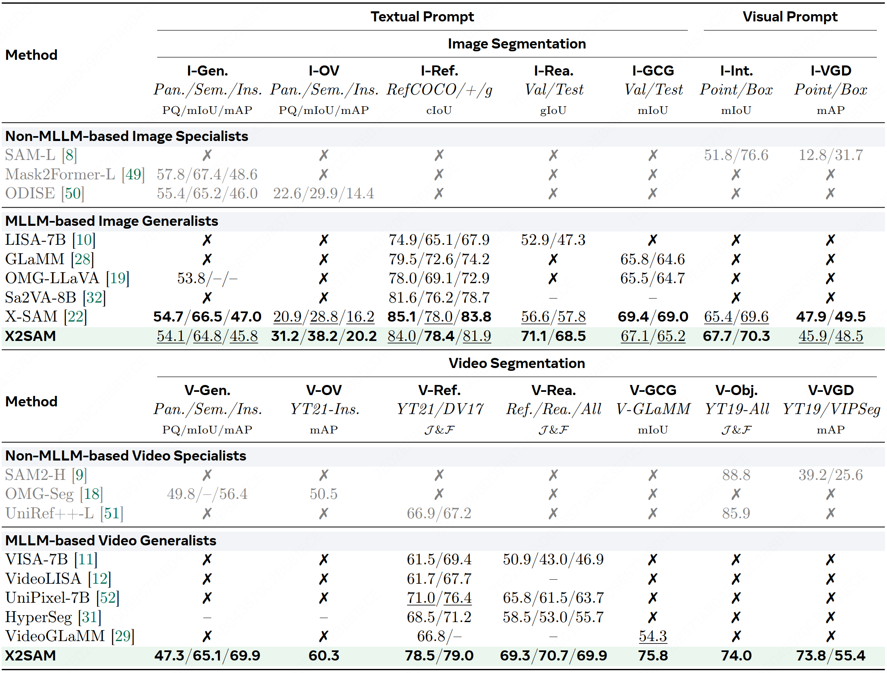
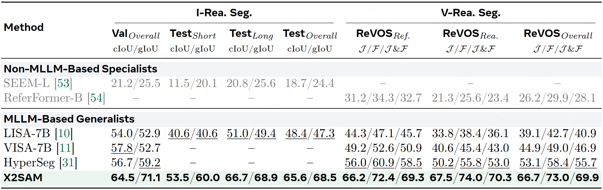
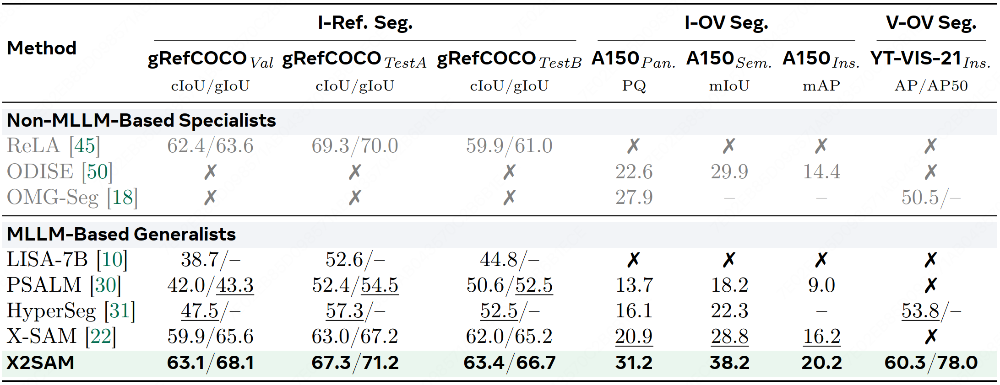
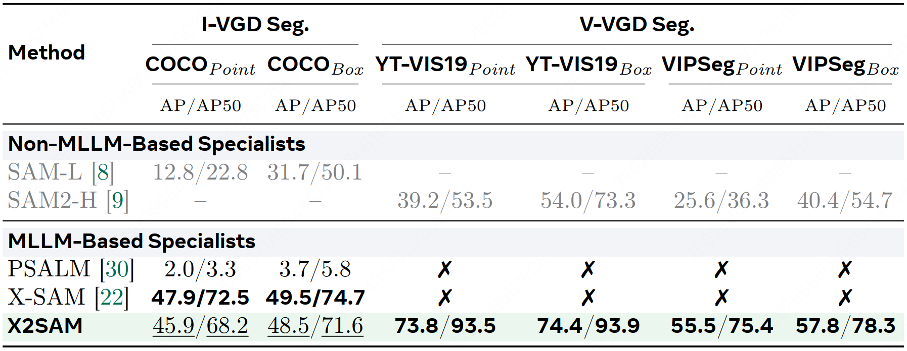
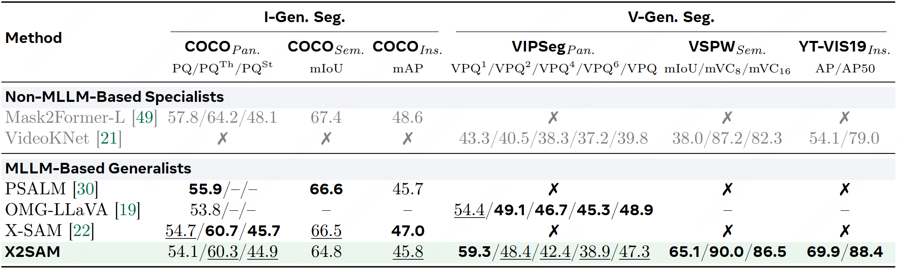
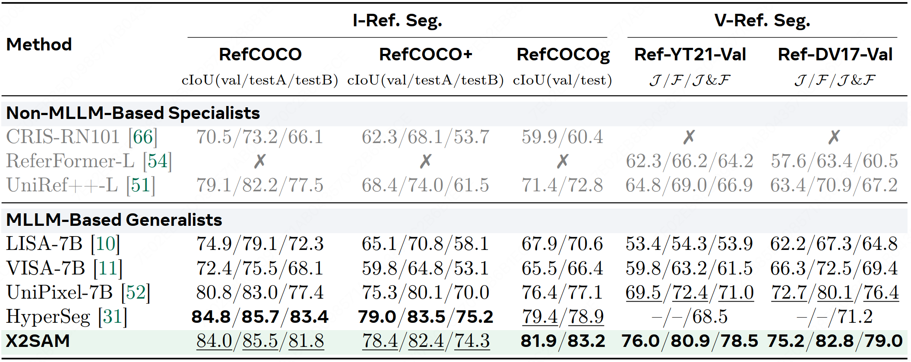
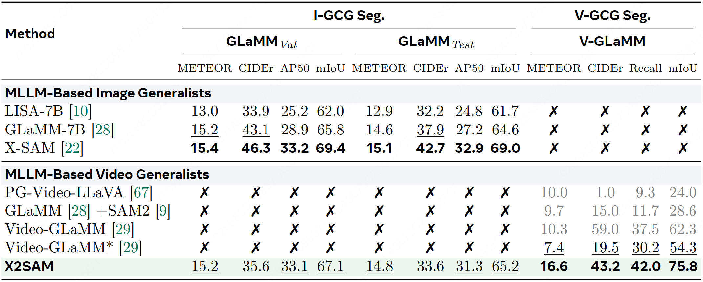
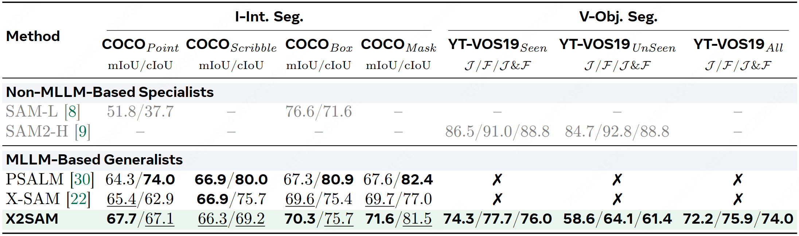
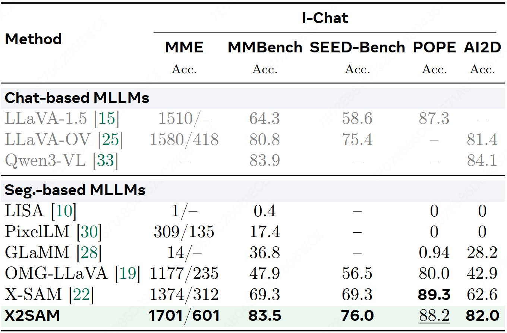
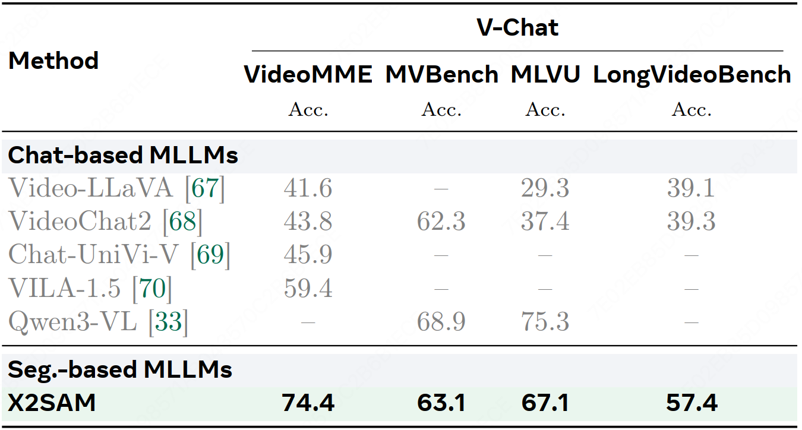

# :bar_chart Benchmarks

## Overall

  
  
<em>Table 1: Comparison of state-of-the-art segmentation methods across image and video segmentation benchmarks, ranging from non-MLLM-based to MLLM-based, and from specialists to generalists. ``x'' denotes unsupported. ``--'' indicates unreported. Best results are in <b>bold</b>, second-best are <u>underlined</u>.</em>

## Reasoning Segmentation

  
  
<em>Table 2: Comparison across image and video reasoning segmentation benchmarks.</em>

## Out-of-Domain Segmentation

  
  
<em>Table 3: Comparison on out-of-domain tasks, including image generalized referring segmentation, image and video open-vocabulary segmentation benchmarks.</em>

## VGD Segmentation

  
  
<em>Table 4: Comparison across image and video visual grounded segmentation benchmarks.</em>

## Generic Segmentation

  
  
<em>Table 5: Comparison across image and video generic segmentation benchmarks.</em>

## Referring Segmentation

  
  
<em>Table 6: Comparison across image and video referring segmentation benchmarks.</em>

## GCG Segmentation

  
  
<em>Table 7: Comparison across image and video grounded conversation generation segmentation benchmarks.  \textcolor{gray}{Grayed} values means the method is reported in the original paper, * means the method is re-evaluated in this work.</em>

## Object-Centric Segmentation

  
  
<em>Table 8: Comparison on object-centric segmentation tasks, including image interactive segmentation (I-Int.) and video object segmentation (V-Obj.) benchmarks.</em>

## Image Chat

  
  
<em>Table 9: Comparison across image chat benchmarks.</em>

## Video Chat

  
  
<em>Table 10: Comparison across video chat benchmarks.</em>

